# Лабораторная работа №2

## Введение в WordPress

### Цель работы

Целью лабораторной работы является изучение процесса установки **WordPress** в локальной среде, знакомство с административной панелью системы, изменение внешнего вида сайта с помощью тем и расширение функциональности сайта с использованием плагинов.


# Ход выполнения работы

## 1. Подготовка среды

Для выполнения лабораторной работы была использована технология контейнеризации **Docker**.

Docker позволяет запускать приложения в изолированных контейнерах, что упрощает настройку среды разработки и исключает необходимость установки веб-сервера и базы данных напрямую в систему.

С помощью Docker были запущены контейнеры с:

* веб-сервером
* базой данных **MySQL**
* системой управления контентом **WordPress**

После запуска контейнеров сайт WordPress стал доступен по адресу:

```
http://localhost:8000
```

База данных для сайта была автоматически создана в контейнере MySQL.

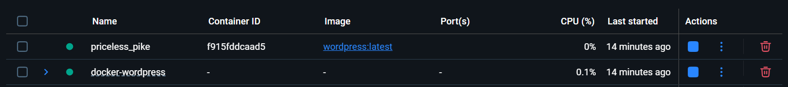


## 2. Установка WordPress

После запуска контейнеров в браузере был открыт адрес локального сайта.
Открылось окно установки WordPress.

На этапе установки были указаны следующие параметры:

* название сайта
* имя администратора
* пароль администратора
* адрес электронной почты

После завершения установки появилась возможность войти в административную панель сайта.

Админ-панель доступна по адресу:

```
http://localhost/wp-admin
```

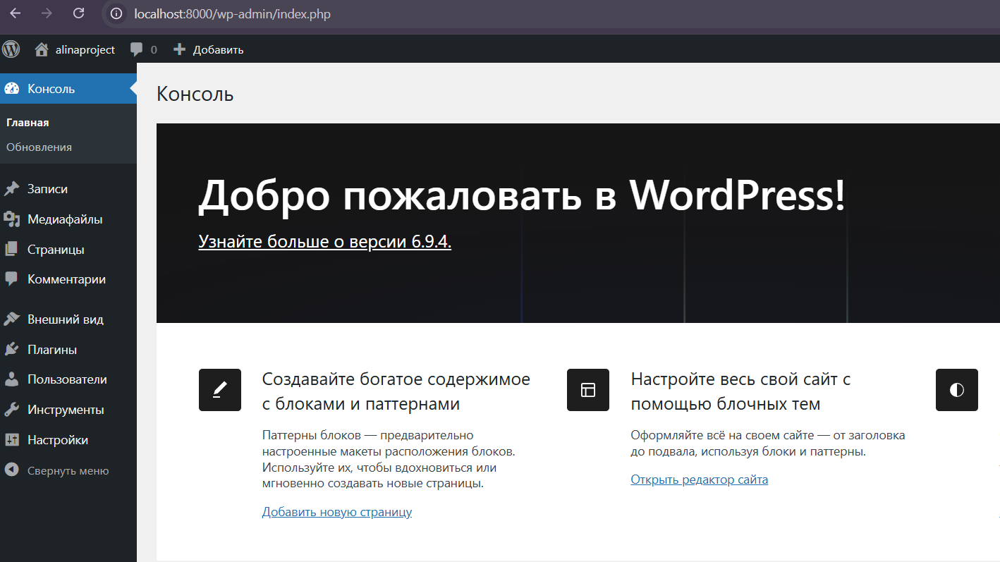
Скриншот: вход в админ-панель


## 3. Первоначальные настройки сайта

После входа в административную панель были выполнены основные настройки сайта.

В разделе **Settings → General** были изменены:

* название сайта
* описание сайта
* часовой пояс

Для удобства ссылок были настроены постоянные ссылки.
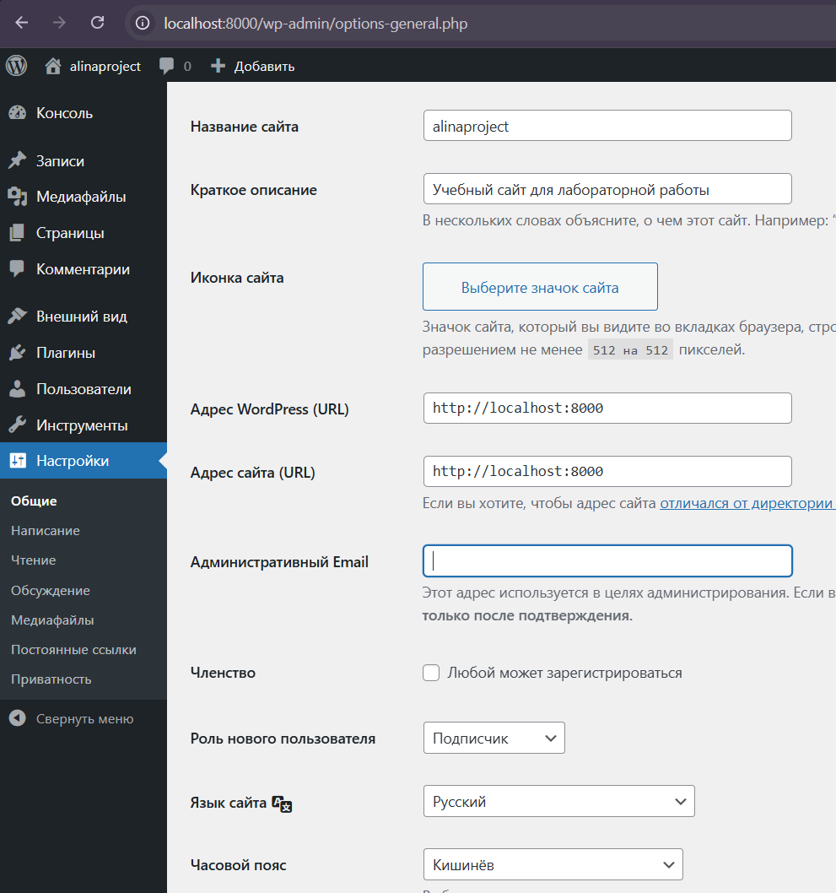
Скриншот: настройки General

В разделе **Settings → Permalinks** был выбран вариант:

```
Post name
```

Это позволяет создавать более удобные и понятные URL-адреса страниц.

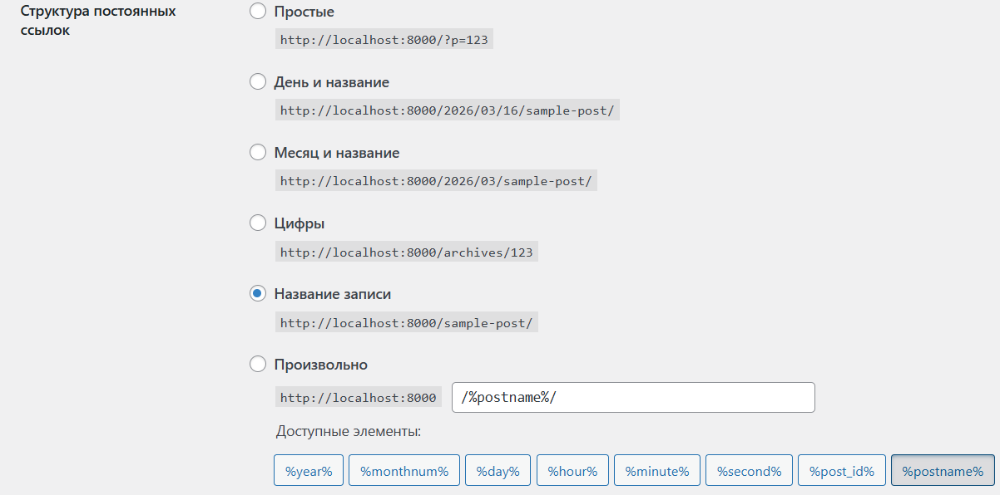
Скриншот: настройки Permalinks


## 4. Работа с темами

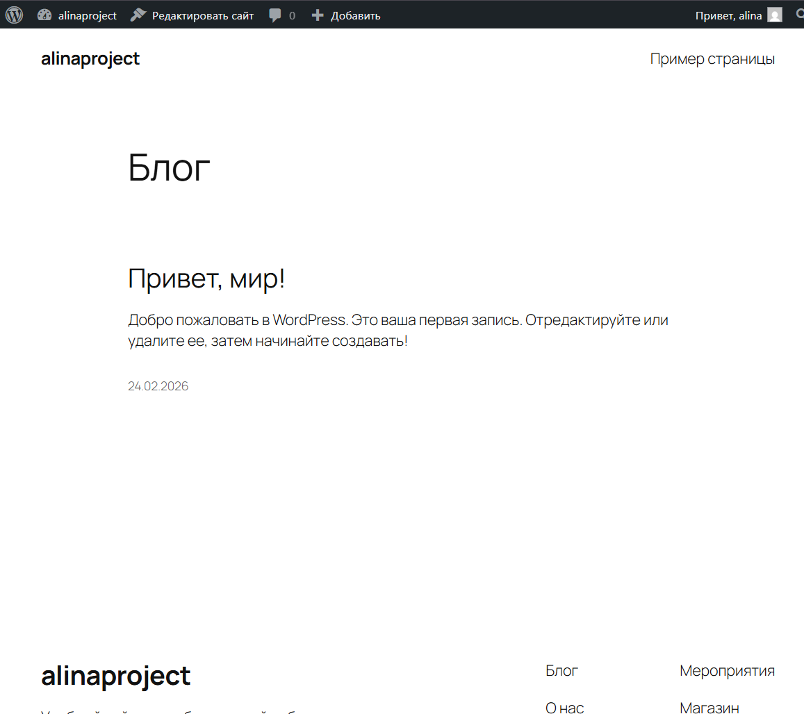
Для изменения внешнего вида сайта была установлена новая тема.


В разделе **Appearance → Themes** была установлена тема
**Astra** из официального каталога WordPress.
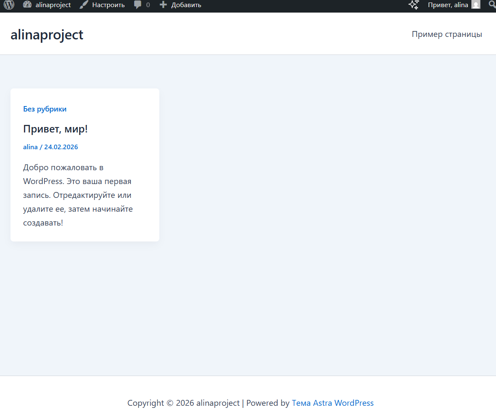

После установки тема была активирована, и внешний вид сайта изменился.

Далее в разделе **Appearance → Customize** были выполнены следующие настройки:
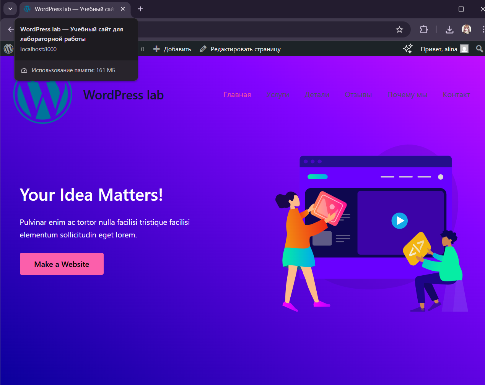
* добавлен логотип сайта
* изменена цветовая схема
* настроены заголовок и описание сайта

Это позволило изменить дизайн сайта без редактирования кода.


## 5. Работа с плагинами

Для расширения функциональности сайта были установлены плагины.

В разделе **Plugins → Add New** были установлены:

* **Classic Editor** — плагин для использования классического редактора записей.
* **Contact Form 7** — плагин для создания формы обратной связи.
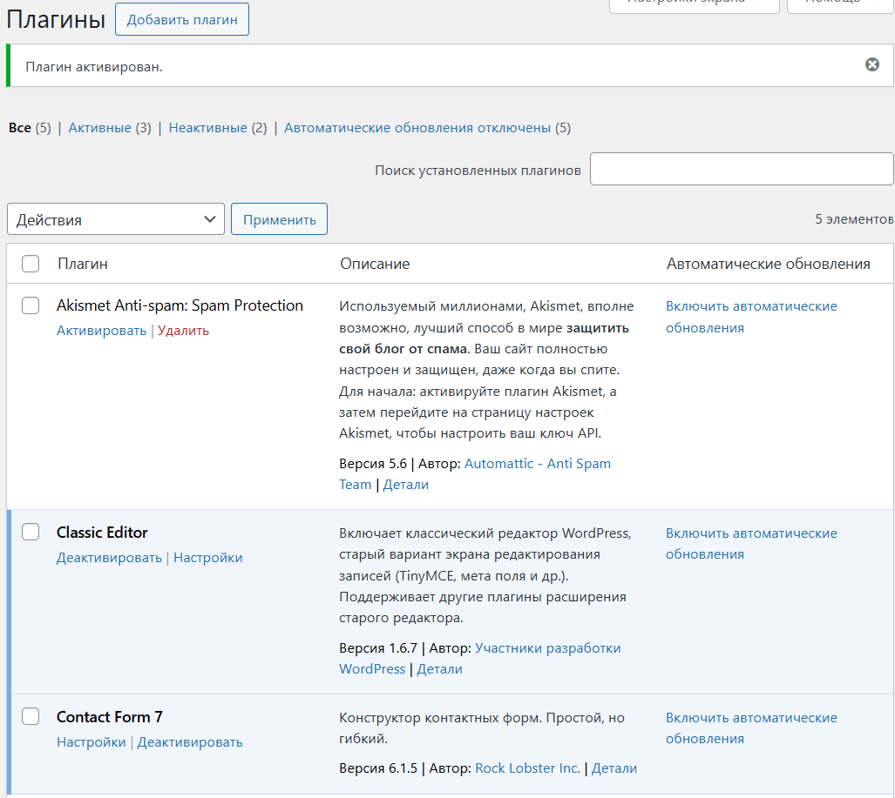
После установки плагины были активированы.

Плагин Classic Editor позволил создавать записи в классическом редакторе WordPress.


Плагин Contact Form 7 позволил создать форму обратной связи, которую можно размещать на страницах сайта.
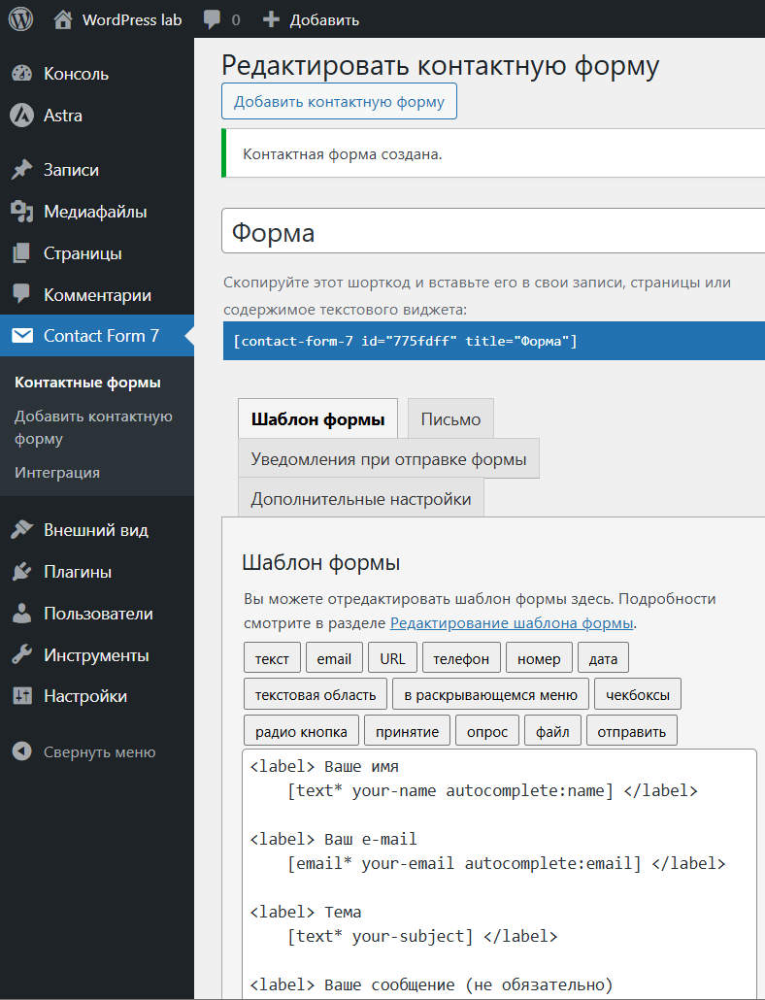
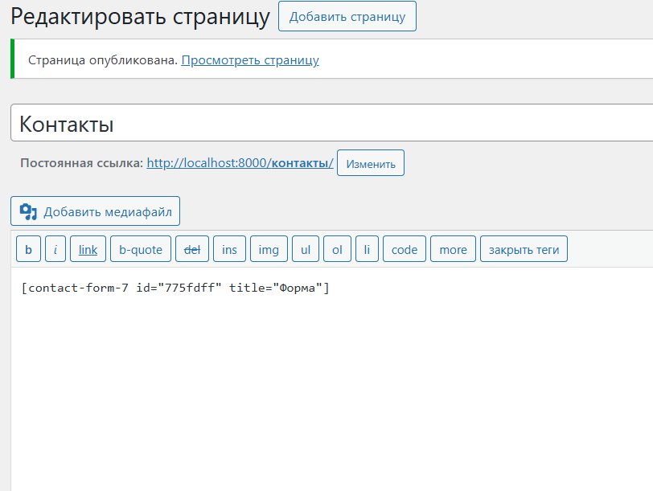


Также был проведён тест: один из плагинов был отключён в разделе **Plugins → Installed Plugins**, после чего его функциональность стала недоступной.
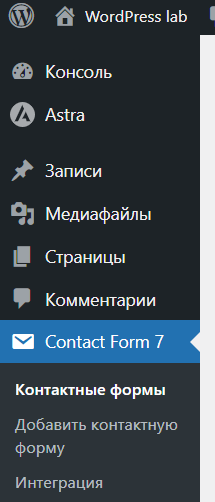
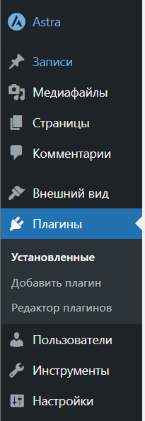


## 6. Создание контента

Для проверки работы сайта был создан контент.

Была создана страница:

**Контакты**

На страницу была добавлена форма обратной связи, созданная с помощью плагина Contact Form 7.
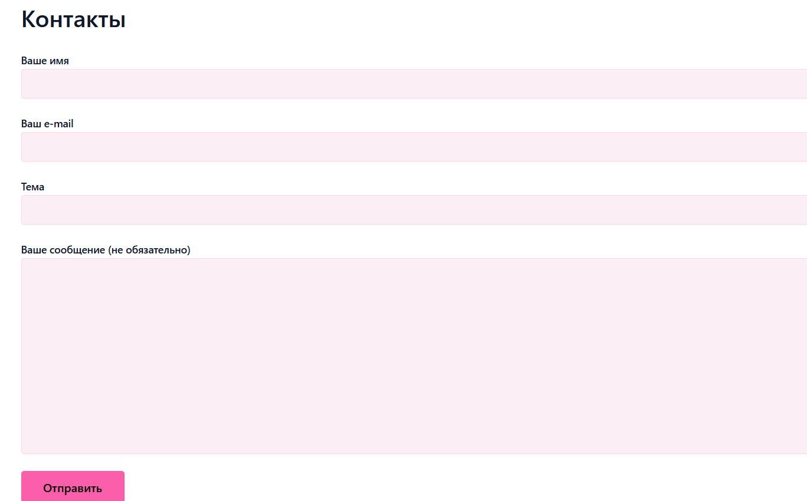

Также были созданы несколько записей в блоге :
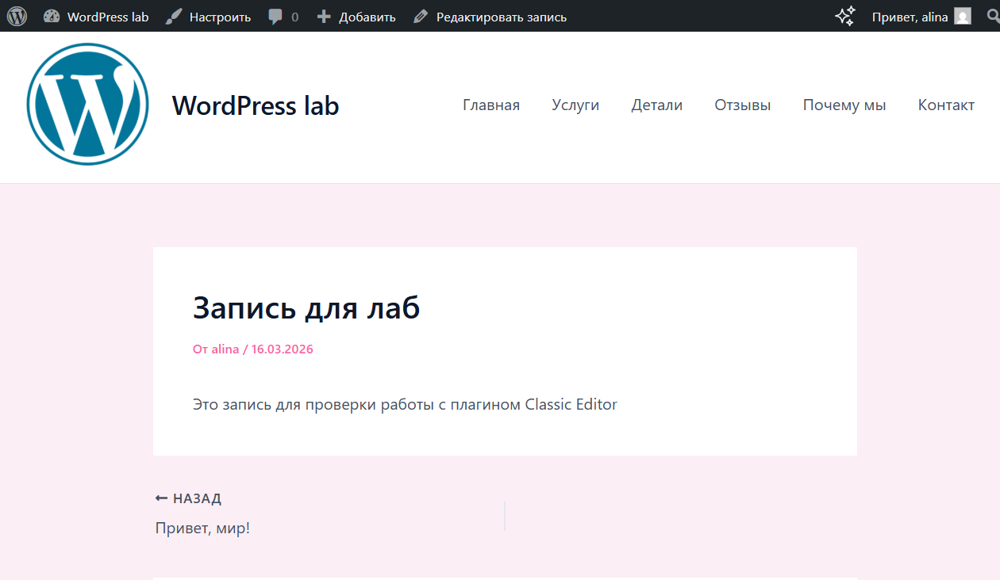
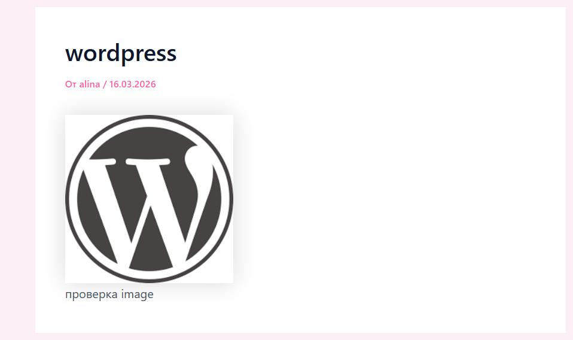
После публикации записей была проверена их корректная работа и отображение на сайте.


# Вывод

В ходе выполнения лабораторной работы была установлена и настроена система управления контентом **WordPress** в локальной среде с использованием **Docker**.

Была изучена структура административной панели, выполнены базовые настройки сайта, установлена новая тема и настроен внешний вид сайта. Также были установлены плагины для расширения функциональности системы.

Кроме того, был создан тестовый контент (страницы и записи), что позволило проверить корректность работы сайта.

В результате работы были получены практические навыки установки, настройки и управления сайтом на платформе WordPress.


## Контрольные вопросы

### 1. Что делает тема в WordPress, а что — плагин?

Тема в WordPress отвечает за внешний вид сайта. Она определяет дизайн страниц, расположение элементов, цвета, шрифты и общий стиль сайта.

Плагин добавляет новую функциональность. С его помощью можно расширять возможности сайта, например добавлять формы обратной связи, SEO-инструменты, галереи изображений или защиту от спама.


### 2. Почему при смене темы контент сайта не теряется?

Контент сайта (страницы, записи, изображения) хранится в базе данных WordPress и не зависит от темы. Тема отвечает только за отображение информации. Поэтому при смене темы меняется только дизайн сайта, а сам контент остаётся.


### 3. Как можно изменить внешний вид сайта без редактирования кода?

Внешний вид сайта можно изменить через административную панель WordPress. Для этого можно:

- установить или сменить тему оформления;
- использовать раздел **Appearance → Customize** для настройки цветов, логотипа и других элементов;
- использовать конструкторы страниц и настройки темы;
- устанавливать дополнительные плагины для изменения дизайна сайта.
