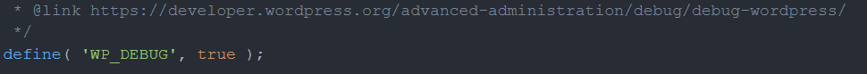
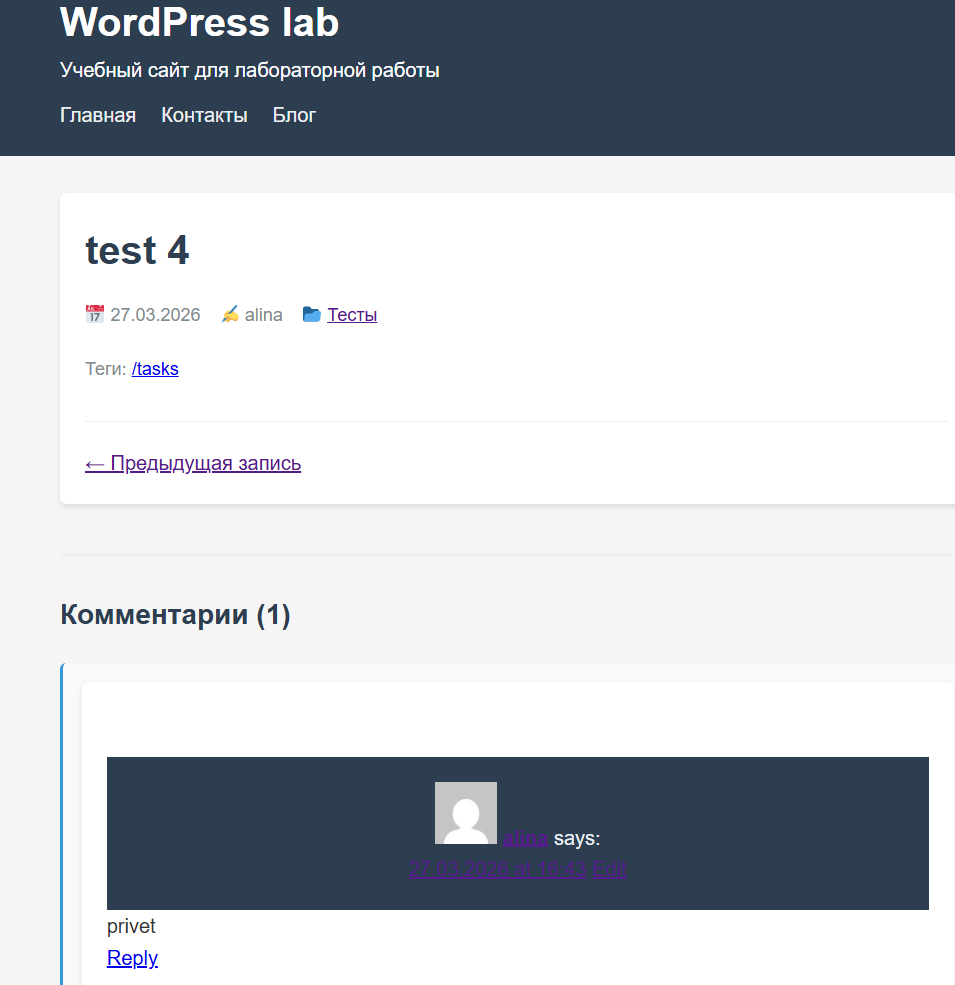
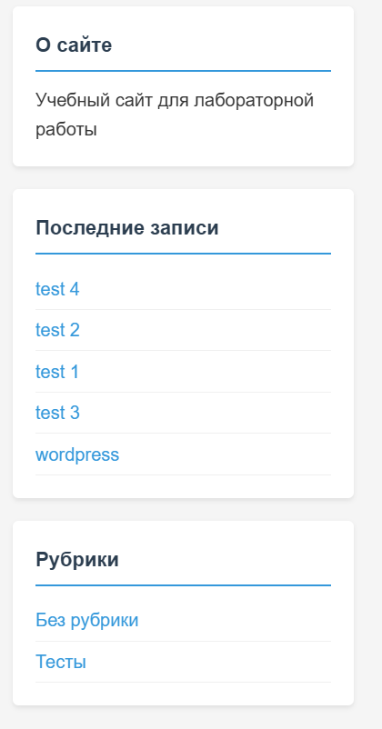
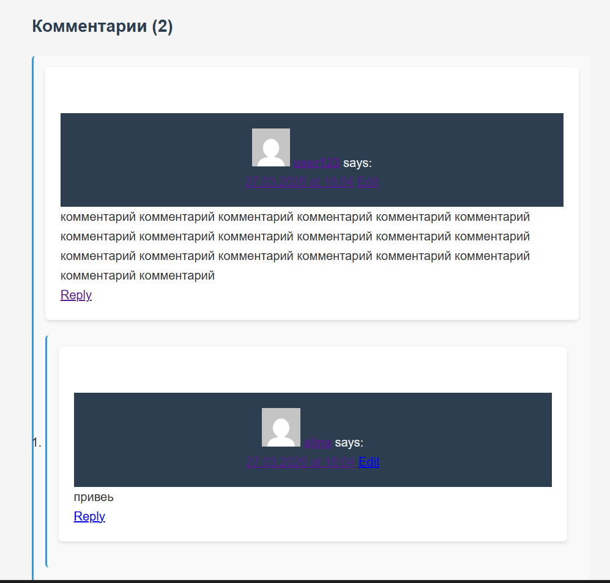
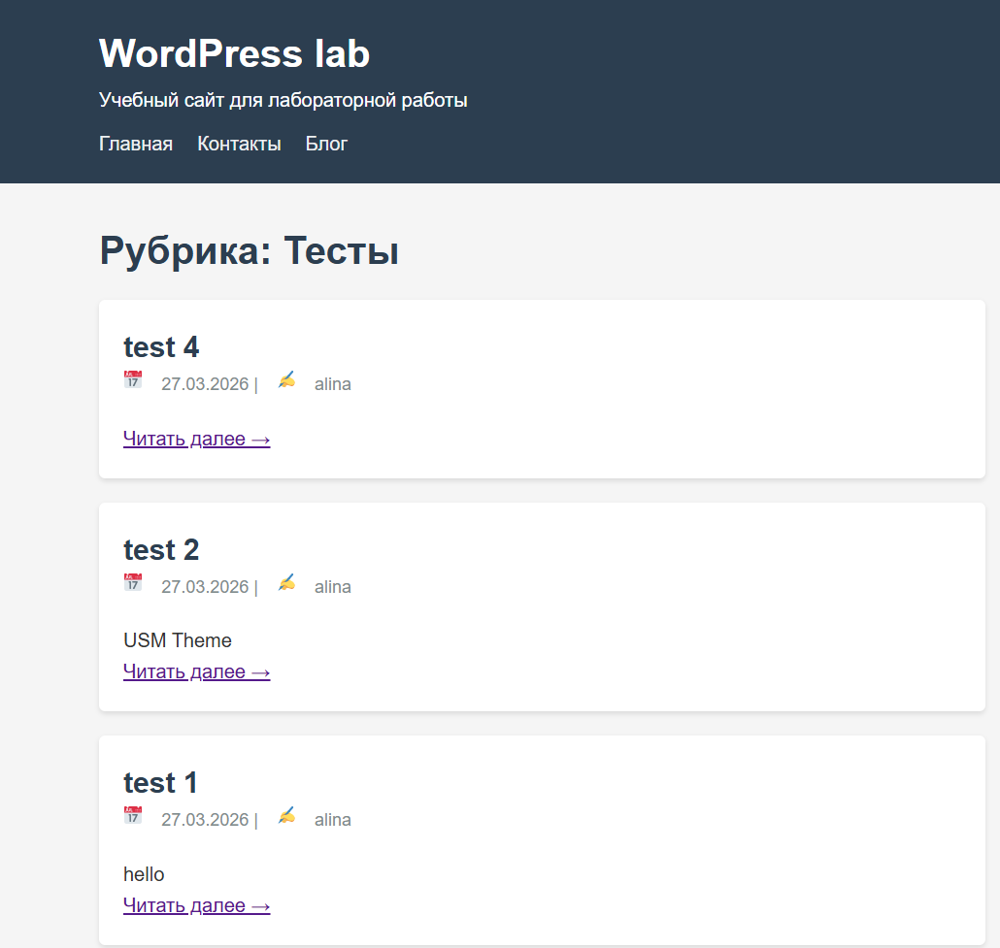
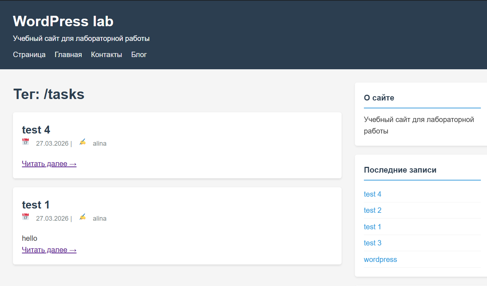
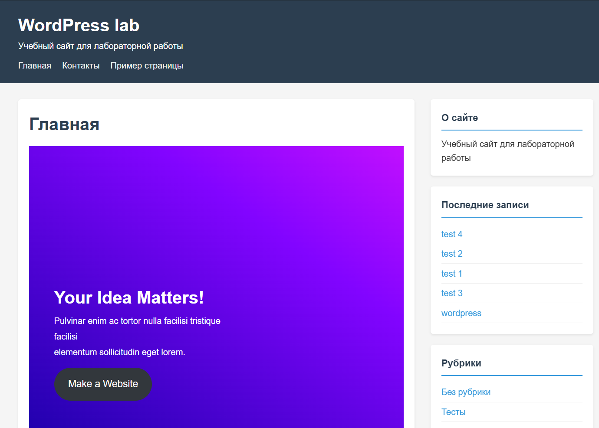
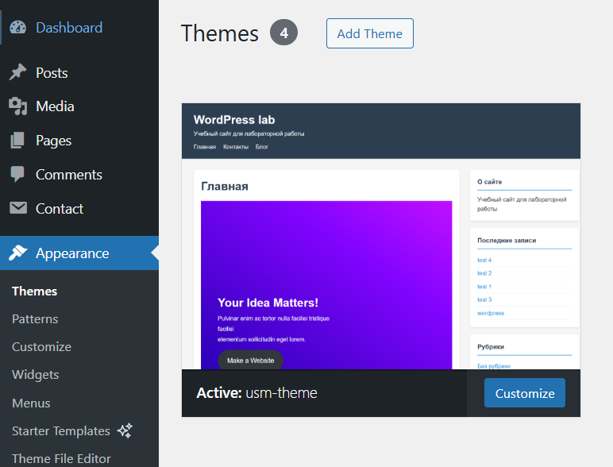

# Лабораторная работа №3. Разработка простой темы WordPress

## Цель работы

Научиться создавать собственную тему WordPress, разобраться в минимальной структуре темы и принципах работы шаблонов.

## Краткое описание работы

В рамках лабораторной работы была разработана собственная тема WordPress usm-theme. Для выполнения работы использовалась среда Docker. Проект создавался в Visual Studio Code, после чего файлы темы были подключены к локальному WordPress-проекту, запущенному в контейнере Docker.

Особенность работы через Docker заключалась в том, что среду при необходимости приходилось запускать или перезапускать вручную. В отличие от XAMPP, где локальные сервисы чаще работают в фоновом режиме автоматически, в данном случае перед проверкой результата нужно было убедиться, что контейнер WordPress запущен.

## Инструкции по запуску проекта

1. Открыть Docker Desktop и убедиться, что Docker Engine запущен.
2. Запустить контейнер с локальным WordPress-проектом.
3. Открыть проект в Visual Studio Code.
4. Перейти в каталог темы WordPress: wp-content/themes/usm-theme.
5. Убедиться, что все файлы темы находятся в этой папке.
6. Открыть локальный сайт WordPress в браузере.
7. В панели администратора перейти в раздел Appearance -> Themes.
8. Найти тему usm-theme и активировать ее.
9. Проверить отображение главной страницы, отдельной записи, страницы, архива и боковой панели.

Если Docker был остановлен, перед проверкой сайта контейнер необходимо было запускать повторно. В ходе выполнения работы именно так и осуществлялся запуск среды.

## Ход выполнения лабораторной работы

### Шаг 1. Подготовка среды

Для выполнения лабораторной работы был использован локальный WordPress в Docker. Проект был открыт в Visual Studio Code, где выполнялось создание и редактирование файлов темы.

Далее была использована папка wp-content/themes, в которой создана директория usm-theme для собственной темы WordPress.

Также по условию лабораторной работы требовалось включить отладку в файле wp-config.php через параметр WP_DEBUG.

### Шаг 2. Создание обязательных файлов темы

В папке usm-theme были созданы обязательные файлы:

1. style.css
2. index.php

Файл style.css содержит стили темы и ее основные метаданные. Файл index.php используется как главный шаблон, через который выводится содержимое главной страницы.

### Шаг 3. Выделение общих частей шаблона

Для повторно используемых частей интерфейса были созданы отдельные шаблоны:

1. header.php
2. footer.php

В главном шаблоне index.php они подключаются при помощи стандартных функций WordPress get_header() и get_footer().

На главной странице реализован вывод последних 5 записей с помощью WP_Query.

### Шаг 4. Создание файла функций

В папке темы был создан файл functions.php. В нем реализованы базовые возможности темы:

1. Подключение основного файла стилей через wp_enqueue_style()
2. Подключение шрифта Google Fonts
3. Поддержка title-tag
4. Поддержка миниатюр записей
5. Поддержка HTML5-разметки
6. Регистрация основного меню
7. Регистрация боковой панели

Это позволяет теме корректно подключать стили, работать с меню и виджетами, а также использовать стандартные возможности WordPress.

### Шаг 5. Создание дополнительных шаблонов

Помимо обязательных файлов были реализованы дополнительные шаблоны:

1. single.php для отображения отдельной записи
2. page.php для отображения отдельной страницы
3. sidebar.php для боковой панели
4. comments.php для блока комментариев
5. archive.php для архивов записей

Файл single.php выводит полную запись, метаинформацию, изображение записи, теги, навигацию между постами и комментарии.

Файл page.php используется для вывода обычных страниц и также подключает комментарии и боковую панель.

Файл sidebar.php выводит виджеты. Если виджетная область не заполнена, отображаются стандартные блоки: описание сайта, последние записи и список рубрик.

Файл comments.php отвечает за вывод списка комментариев и формы их добавления.

Файл archive.php выводит архивные страницы по рубрикам, тегам, автору и датам.

### Шаг 6. Стилизация темы

В файле style.css были добавлены стили для основных элементов сайта:

1. Шапка сайта
2. Подвал
3. Основной контент
4. Карточки записей
5. Боковая панель
6. Комментарии
7. Пагинация
8. Адаптивное отображение на небольших экранах

### Шаг 7. Скриншот темы

По условию задания в папку темы необходимо добавить файл screenshot.png размером 1200x900 px для отображения превью темы в админ-панели WordPress.

### Шаг 8. Активация темы

После создания файлов тема активировалась через административную панель WordPress:

1. Вход в админ-панель WordPress
2. Переход в раздел Appearance -> Themes
3. Выбор темы usm-theme
4. Нажатие кнопки Activate
5. Проверка отображения сайта на стороне пользователя

## Контрольные вопросы

**1. Обязательные файлы темы WordPress:**

* `style.css` — содержит информацию о теме
* `index.php` — основной шаблон сайта

**2. Как подключаются общие части (header, footer, sidebar):**
Используются специальные функции:

* `get_header();`
* `get_footer();`
* `get_sidebar();`

**3. Разница между файлами:**

* `index.php` — общий шаблон (если нет других)
* `single.php` — для отдельных записей (постов)
* `page.php` — для статических страниц

**4. Зачем нужен `functions.php`:**

* добавляет функции и настройки темы
* подключает стили, скрипты
* расширяет возможности WordPress

## Использованные источники

1. Официальная документация WordPress: https://developer.wordpress.org/themes/
2. Template Hierarchy в WordPress: https://developer.wordpress.org/themes/basics/template-hierarchy/
3. Функция wp_enqueue_style(): https://developer.wordpress.org/reference/functions/wp_enqueue_style/
4. Функция comments_template(): https://developer.wordpress.org/reference/functions/comments_template/
5. Функция register_sidebar(): https://developer.wordpress.org/reference/functions/register_sidebar/

## Дополнительные важные аспекты

1. Для работы использовался Docker, поэтому перед проверкой проекта нужно было контролировать состояние контейнера и при необходимости запускать его заново.
2. Проект разрабатывался в Visual Studio Code, что упростило создание структуры темы и редактирование шаблонов.
3. Тема реализована как учебный пример, но уже содержит не только обязательные файлы, а также дополнительные шаблоны и поддержку стандартных функций WordPress.

## Вывод

В ходе лабораторной работы была создана собственная тема WordPress с базовой структурой шаблонов. Были изучены принципы подключения общих частей страницы, вывода записей через цикл WordPress, подключения стилей и регистрации дополнительных возможностей темы.

Использование Docker позволило развернуть локальную среду для WordPress и выполнить все этапы разработки темы. В результате была получена рабочая учебная тема usm-theme, которую можно активировать и использовать в локальном проекте WordPress.

