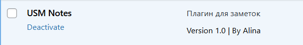
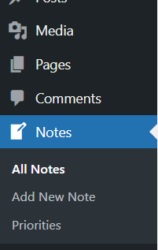
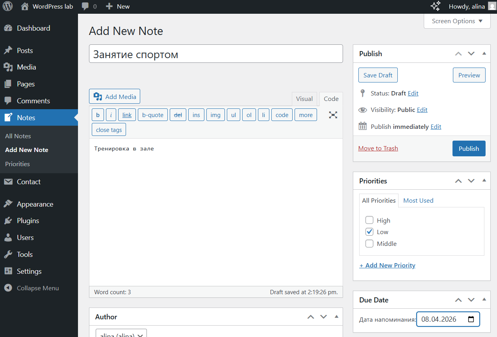
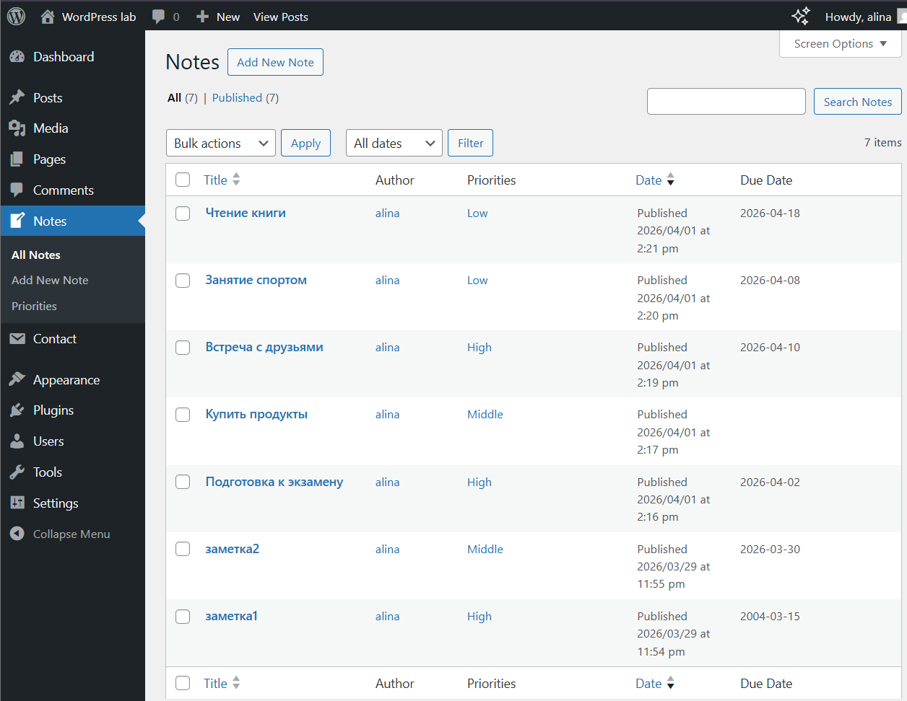
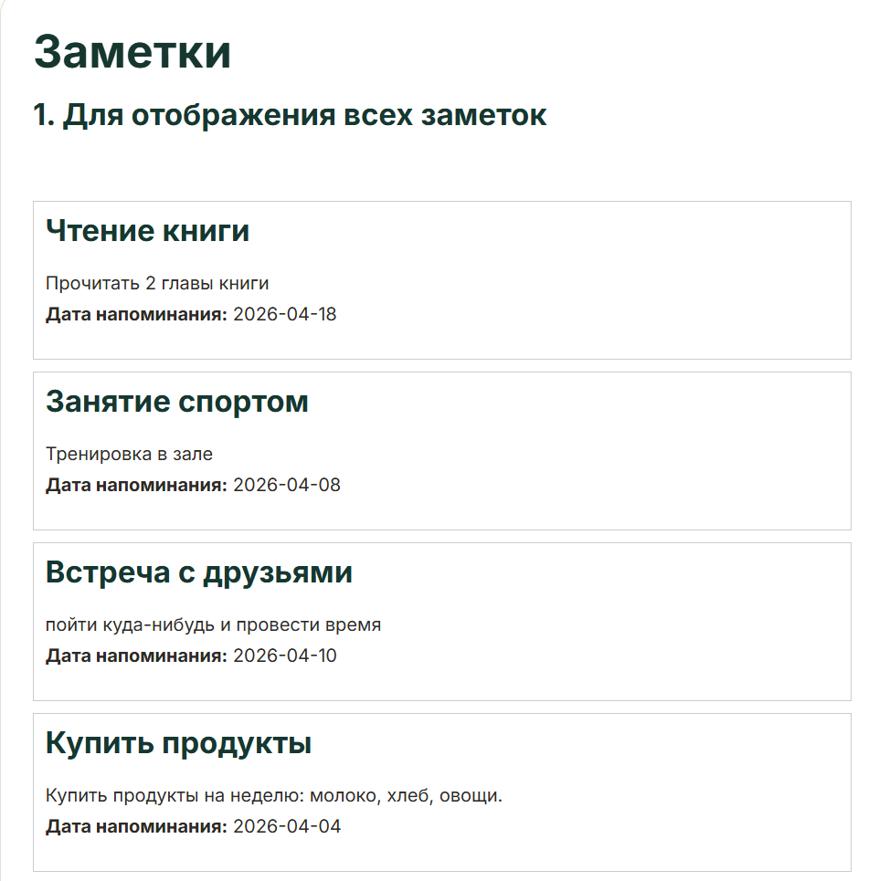
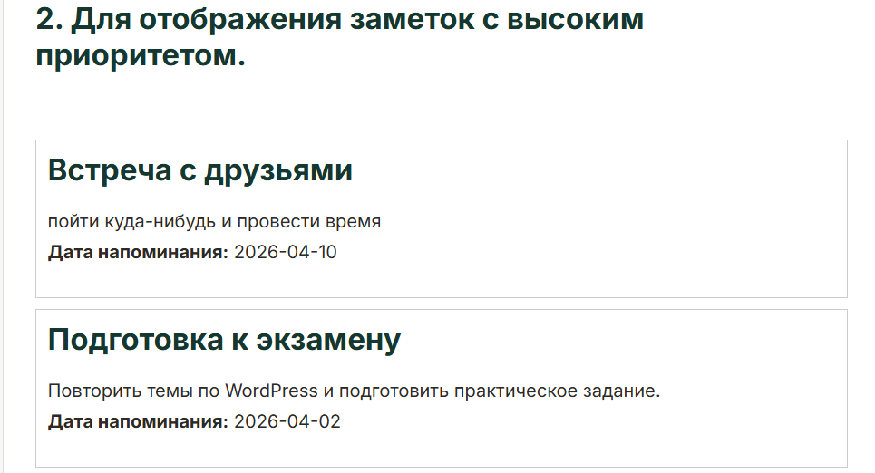
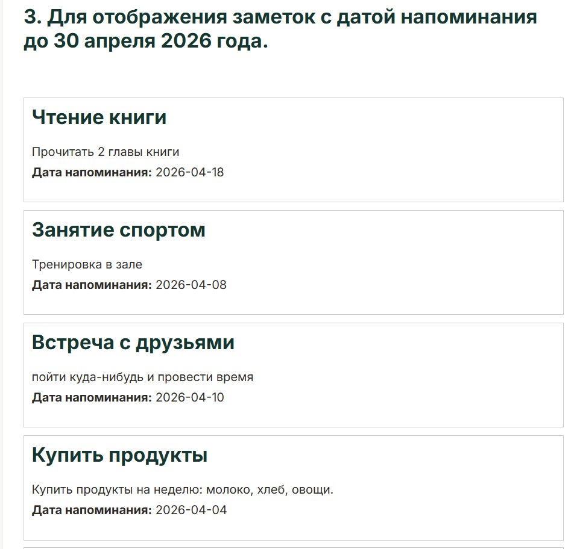

# Лабораторная работа №4. Разработка плагина для WordPress

## Цель работы
Освоить расширяемую модель данных WordPress: создать CPT (Custom Post Type), пользовательскую таксономию, метаданные с метабоксом в админ-панели, а также реализовать виджет для отображения данных на сайте.


## Шаг 1. Подготовка среды
1. Перешли в папку `wp-content/plugins`.
2. Создали папку плагина `usm-notes`.
3. Включили режим отладки в файле `wp-config.php`:
```php
define('WP_DEBUG', true);
```

## Шаг 2. Создание основного файла плагина
1. Создали файл usm-notes.php.
2. Добавили метаданные плагина:
/*
Plugin Name: USM Notes
Description: Плагин для заметок
Version: 1.0
Author: Alina
*/
3. Активировали плагин в админ-панели WordPress.



## Шаг 3. Регистрация Custom Post Type (CPT)
Добавлена функция `usm_register_notes()`, которая регистрирует пользовательский тип записей «Заметки» (`usm_note`) с помощью `register_post_type()`.
```php
function usm_register_notes() {
$labels = array(
    'name' => 'Notes',
    'singular_name' => 'Note',
    'add_new' => 'Add New Note',
    'add_new_item' => 'Add New Note',
    'edit_item' => 'Edit Note',
    'all_items' => 'All Notes',
    'view_item' => 'View Note',
    'search_items' => 'Search Notes',
);


$args = array(
    'labels' => $labels,
    'public' => true,
    'has_archive' => true,
    'supports' => array( 'title', 'editor', 'author', 'thumbnail' ),
    'menu_icon' => 'dashicons-welcome-write-blog',

);
    register_post_type( 'usm_note', $args );
    }
add_action( 'init', 'usm_register_notes' );
```
**Параметры CPT:**
- `public => true` — тип записей виден публично.
- `has_archive => true` — наличие архивной страницы.
- `supports` — поддержка заголовка, редактора, автора и миниатюры.
- `menu_icon` — иконка `dashicons-welcome-write-blog` в меню администратора.
- Массив `labels` для удобного отображения названий в интерфейсе.

Функция подключена к хуку `init`.



## Шаг 4. Регистрация пользовательской таксономии
Добавлена функция `usm_register_priority_taxonomy()`, регистрирующая таксономию «Приоритет» (`usm_priority`) через `register_taxonomy()`.

**Параметры таксономии:**
- `hierarchical => true` — иерархическая структура (как категории).
- `show_admin_column => true` — отображение в списке записей в админке.
- `rewrite => array('slug' => 'priority')` — ЧПУ-адрес.
- Таксономия привязана к CPT `usm_note`.

Функция подключена к хуку `init`.

```php
function usm_register_priority_taxonomy() {
    $labels = array(
        'name' => 'Priorities',
        'singular_name' => 'Priority',
        'search_items' => 'Search Priorities',
        'all_items' => 'All Priorities',
        'edit_item' => 'Edit Priority',
        'update_item' => 'Update Priority',
        'add_new_item' => 'Add New Priority',
        'new_item_name' => 'New Priority Name',
        'menu_name' => 'Priorities',
    );

    $args = array(
        'hierarchical' => true,
        'labels' => $labels,
        'show_admin_column' => true,
        'rewrite' => array( 'slug' => 'priority' ),
    );

    register_taxonomy( 'usm_priority', array( 'usm_note' ), $args );
}

add_action( 'init', 'usm_register_priority_taxonomy' );
```


## Шаг 5. Добавление метабокса для даты напоминания


### 5.1 Регистрация метабокса

Функция `usm_add_note_meta_box()` добавляет метабокс «Due Date» в боковую панель редактора заметок с помощью `add_meta_box()`.

```php
function usm_add_note_meta_box() {
    add_meta_box(
        'usm_due_date',
        __('Due Date', 'usm-plugin'),
        'usm_render_due_date_meta_box',
        'usm_note',
        'side',
        'default'
    );
}
add_action('add_meta_boxes', 'usm_add_note_meta_box');
```

### 5.2 Рендер метабокса

Функция `usm_render_due_date_meta_box()` отображает поле ввода даты (`input type="date"`), предварительно получив сохранённое значение через `get_post_meta()`. Для безопасности генерируется nonce-поле.

```php
function usm_render_due_date_meta_box($post) {
    $due_date = get_post_meta($post->ID, '_usm_due_date', true);
    wp_nonce_field('usm_save_due_date', 'usm_due_date_nonce');

    echo '<label for="usm_due_date">Дата напоминания:</label>';
    echo '<input type="date" id="usm_due_date" name="usm_due_date"
          value="' . esc_attr($due_date) . '" required />';
}
```

### 5.3 Сохранение метаданных

Функция `usm_save_note_meta()` вызывается при сохранении записи. Реализованы следующие проверки:

- Проверка nonce для защиты от CSRF.
- Пропуск автосохранений (`DOING_AUTOSAVE`).
- Проверка типа записи — только `usm_note`.
- Проверка прав пользователя (`edit_post`).
- **Валидация даты:** дата не может быть в прошлом. Если дата меньше текущей, сохранение прерывается.
- Санитизация входных данных через `sanitize_text_field()`.

```php
function usm_save_note_meta($post_id, $post) {
    if (!isset($_POST['usm_due_date_nonce']) ||
        !wp_verify_nonce($_POST['usm_due_date_nonce'], 'usm_save_due_date')) {
        return;
    }
    if (defined('DOING_AUTOSAVE') && DOING_AUTOSAVE) return;
    if ($post->post_type != 'usm_note') return;
    if (!current_user_can('edit_post', $post_id)) return;

    if (isset($_POST['usm_due_date'])) {
        $due_date = sanitize_text_field($_POST['usm_due_date']);
        if ($due_date < date('Y-m-d')) return; // Валидация: дата не в прошлом
        update_post_meta($post_id, '_usm_due_date', $due_date);
    } else {
        delete_post_meta($post_id, '_usm_due_date');
    }
}
add_action('save_post', 'usm_save_note_meta', 10, 2);
```

### 5.4 Отображение даты на странице записи

Через фильтр `the_content` дата напоминания выводится под контентом при просмотре отдельной заметки.

```php
function usm_display_due_date($content) {
    if (is_singular('usm_note')) {
        $due_date = get_post_meta(get_the_ID(), '_usm_due_date', true);
        if ($due_date) {
            $content .= '<p><strong>Дата напоминания:</strong> '
                      . esc_html($due_date) . '</p>';
        }
    }
    return $content;
}
add_filter('the_content', 'usm_display_due_date');
```

### 5.5 Колонка «Due Date» в списке записей

Добавлена пользовательская колонка в таблицу заметок в административной панели.

```php
function usm_add_due_date_column($columns) {
    $columns['usm_due_date'] = 'Due Date';
    return $columns;
}
add_filter('manage_usm_note_posts_columns', 'usm_add_due_date_column');

function usm_show_due_date_column($column, $post_id) {
    if ($column == 'usm_due_date') {
        echo get_post_meta($post_id, '_usm_due_date', true);
    }
}
add_action('manage_usm_note_posts_custom_column', 'usm_show_due_date_column', 10, 2);
```


## Шаг 6. Создание шорткода для отображения заметок
Функция `usm_notes_shortcode()` обрабатывает шорткод `[usm_notes]` с двумя необязательными параметрами:

| Параметр | Описание |
|---|---|
| `priority` | Фильтр по slug приоритета (например, `high`) |
| `before_date` | Фильтр по дате: отображать заметки с Due Date ≤ указанной дате |

Если параметры не указаны — выводятся все заметки. При отсутствии результатов выводится сообщение: нет заметок с заданныии параметрами

```php
function usm_notes_shortcode($atts){
    $atts = shortcode_atts( array(
        'priority' => '',
        'before_date' => '',
    ), $atts);
    
    $args = array(
        'post_type' => 'usm_note',
        'posts_per_page' => -1,
    );

    if ($atts ['priority']) {
        $args['tax_query'] = array(
            array(
                'taxonomy' => 'usm_priority',
                'field' => 'slug',
                'terms' => $atts['priority'],
            ),
        );
    }

    if ($atts ['before_date']) {
        $args['meta_query'] = array(
            array(
                'key' => '_usm_due_date',
                'value' => $atts['before_date'],
                'compare' => '<=',
                'type' => 'DATE'
            ),
        );
    }


    $query = new WP_Query($args);
    $output = '';

    if ($query->have_posts()) {
        while ($query->have_posts()) {
            $query->the_post();
                $output .= '<div class="usm-note">';
             $output .= '<h2>' . get_the_title() . '</h2>';
             $output .= '<div>' . get_the_content() . '</div>';
     }
     wp_reset_postdata();
     } else {
        $output = 'Нет заметок с заданными параметрами';
        }
        return $output;

}
add_shortcode( 'usm_notes', 'usm_notes_shortcode' );
```

### Стили для отображения заметок

Базовые CSS-стили подключены через хук `wp_head`:

```php
function usm_notes_styles() {
    echo '<style>
        .usm-note {
            border: 1px solid #ccc;
            padding: 10px;
            margin-bottom: 10px;
        }
        .usm-note h2 {
            margin-top: 0;
        }
    </style>';
}
add_action('wp_head', 'usm_notes_styles');
```

## Шаг 7. Тестирование плагина
### 7.1 Создание тестовых данных
Созданы 5–6 заметок с разными приоритетами и датами:



### 7.2 Тестирование шорткодов
Создана страница **«Заметки»** со следующими шорткодами:

```
[usm_notes]
```


Выводит все заметки без фильтрации.

```
[usm_notes priority="High"]
```

Выводит только заметки с приоритетом **High**.

```
[usm_notes before_date="2026-04-30"]
```

Выводит заметки с датой напоминания до 30 апреля 2026 года.


## Вывод
В ходе лабораторной работы был разработан полнофункциональный плагин USM Notes для WordPress. В процессе работы были использованы следующие механизмы:
    - **Custom Post Type** - регистрация собственного типа записей с расширенными параметрами и метками.
    - **Custom Taxonomy** - создание иерархической таксономии «Приоритет», связанной с CPT.
    - **Meta Boxes** - добавление пользовательского поля в редактор с валидацией, nonce-защитой и санитизацией данных.
    - **WP_Query** - гибкая выборка записей с фильтрацией по таксономии (tax_query) и метаданным (meta_query).
    - **Shortcode** - создание параметризованного шорткода для вывода заметок на странице сайта.
    - **Hooks & Filters** - использование хуков `init`, `add_meta_boxes`, `save_post`, `the_content`, `wp_head` и фильтров для расширения функциональности WordPress.


## Контрольные вопросы
1) Чем пользовательская таксономия принципиально отличается от метаполя? Приведи пример, когда выбрать таксономию, а когда - метаданные

- **Таксономия** — используется для группировки записей (как категории).  У нас это приоритеты High, Middle и Low.
- **Метаполе** — хранит дополнительную информацию (как дата, число, текст).

**Пример:**
- Таксономия → приоритет (High / Medium / Low) — удобно фильтровать и сортировать  
- Метаполе → дата напоминания — это просто данные, не для группировки


2) Зачем нужен nonce при сохранении метаполей и что произойдёт, если его не проверять?
Nonce — это защита от подделки запросов (безопасность).

Если его не проверять:
- злоумышленник может отправить запрос от имени пользователя  
- данные (например дата) могут измениться без ведома пользователя  


3) Какие аргументы register_post_type() и register_taxonomy() чаще всего важны для фронтенда и UX (назови минимум три и объясни почему).
- **public** - делает записи видимыми на сайте  
- **labels** - отвечает за удобные названия в админке (UX)  
- **supports** - определяет, какие поля доступны (заголовок, текст, картинка)  
- **has_archive** - создаёт страницу со списком записей  
- **hierarchical (для таксономии)** - позволяет делать структуру как категории  


## Использованные источники
1. Репозиторий, автор Никита Нартя URL: https://github.com/MSU-Courses/content-management-systems