# Лабораторная работа №5. Безопасность WordPress

## Цель работы
Закрепить ключевые практики безопасности WordPress: управление ролями и паролями, обновления, базовое hardening (wp-config.php, права, отключение редактора), резервное копирование, мониторинг активности и поэтапная настройка All In One WP Security & Firewall (AIOS) для защиты от брутфорса, базового WAF и контроля прав.

## Шаг 1. Подготовка среды
1. В локальной установке WordPress перешли в админ-панель. 
2. Убедитесь, что у нас есть доступ администратора.
3. Включили режим отладки в файле `wp-config.php`:
```php
define('WP_DEBUG', true);
```

## Шаг 2. Управление ролями и паролями
1. Создали тестового пользователя c ролью Автор (для дальнейших проверок).
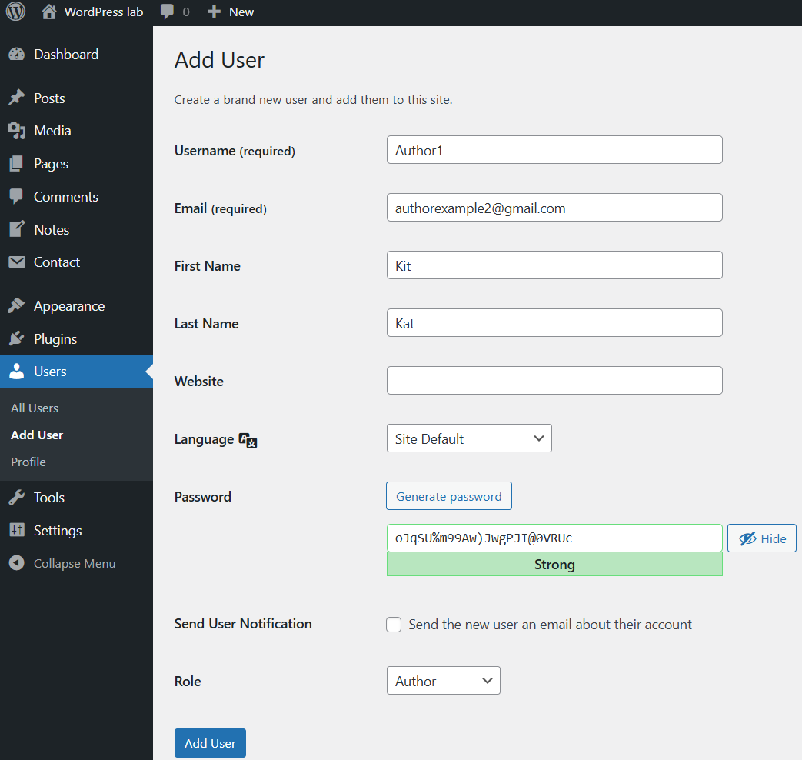
2. Проверили, что у каждого администратора включены сложные пароли (8+ символов, буквы/цифры/символы).
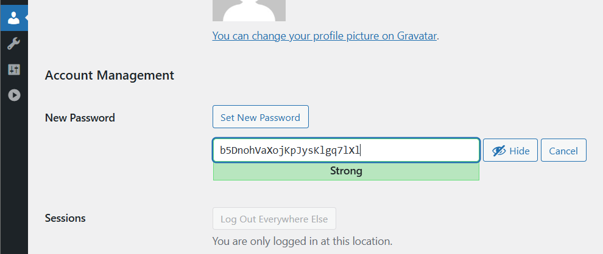

## Шаг 3. Обновления ядра, тем и плагинов
1. Проверяем наличие обновлений для WordPress, тем и плагинов.
2. Обновите всё до последних версий.
3. Настройте автоматические обновления для тем и плагинов.
Dashboard → Plugins → Installed Plugins → Enable auto-updates
          → Appearance → Themes → Enable auto-updates
4. Проверили, что все обновления прошли успешно и сайт работает корректно.

## Шаг 4. Базовое hardening
1. Запрет редактирования файлов
Открыли wp-config.php и добавили:
```php
define('DISALLOW_FILE_EDIT', true);
```
2. Настроим верные права на файлы и папки:
Папки: 755
Файлы: 644
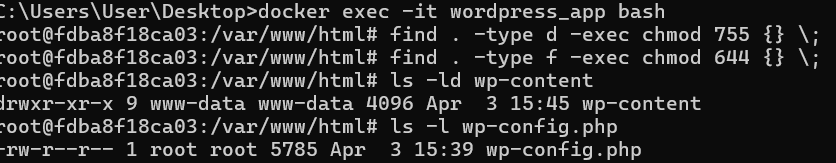
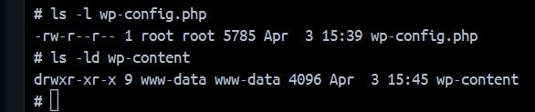
**у меня винда поэтому это удалила**

3. Защита wp-config.php
Откроем файл: `.htaccess`
Добавляем:

```apache
<files wp-config.php>
order allow,deny
deny from all
</files>
```

## Шаг 5. Установка и первичная настройка All In One WP Security & Firewall (AIOS) 
1. Установка
В админ-панели WordPress:
Plugins → Add New → AIOS → Install → Activate
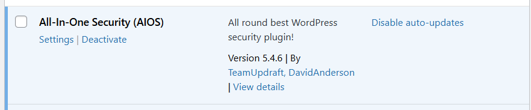

2. Настроим следующие параметры:

### User Login
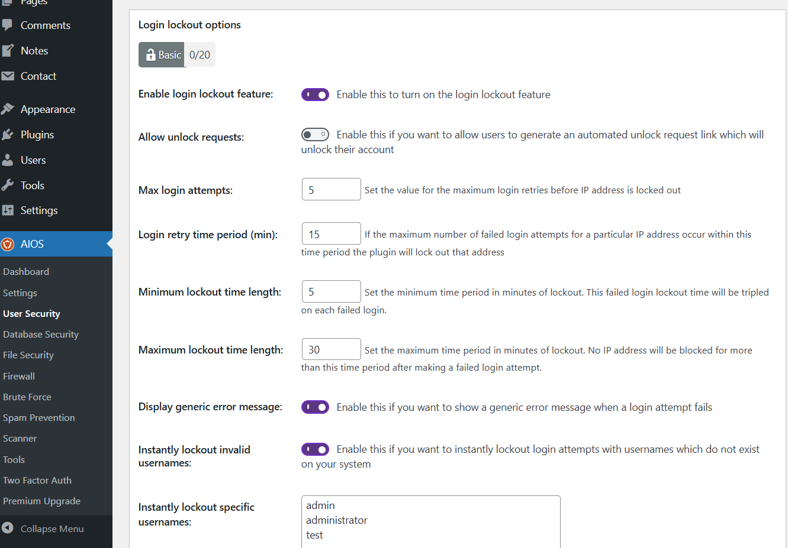

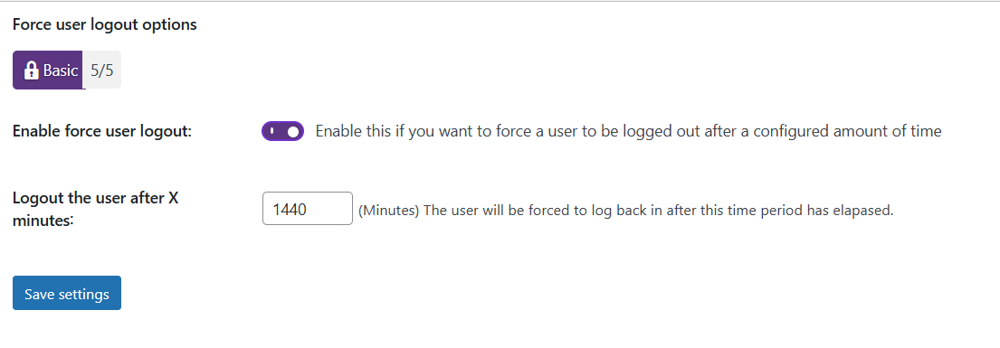


### User Accounts:
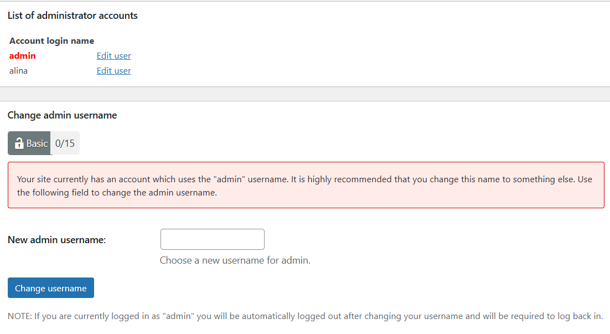
Создали пользователя с ником admin для проверки
WP Security → User Accounts → Change Username
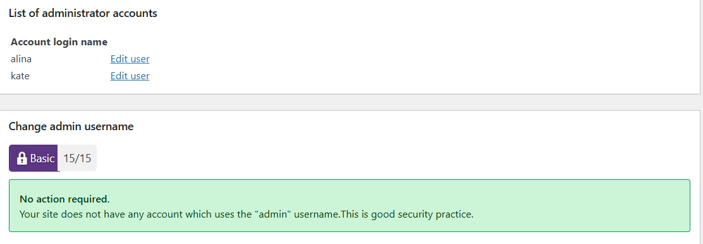


### User Registration
В админке WordPress → Settings → General 
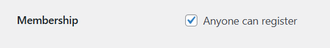
Включено → регистрация открыта


### Filesystem Security:
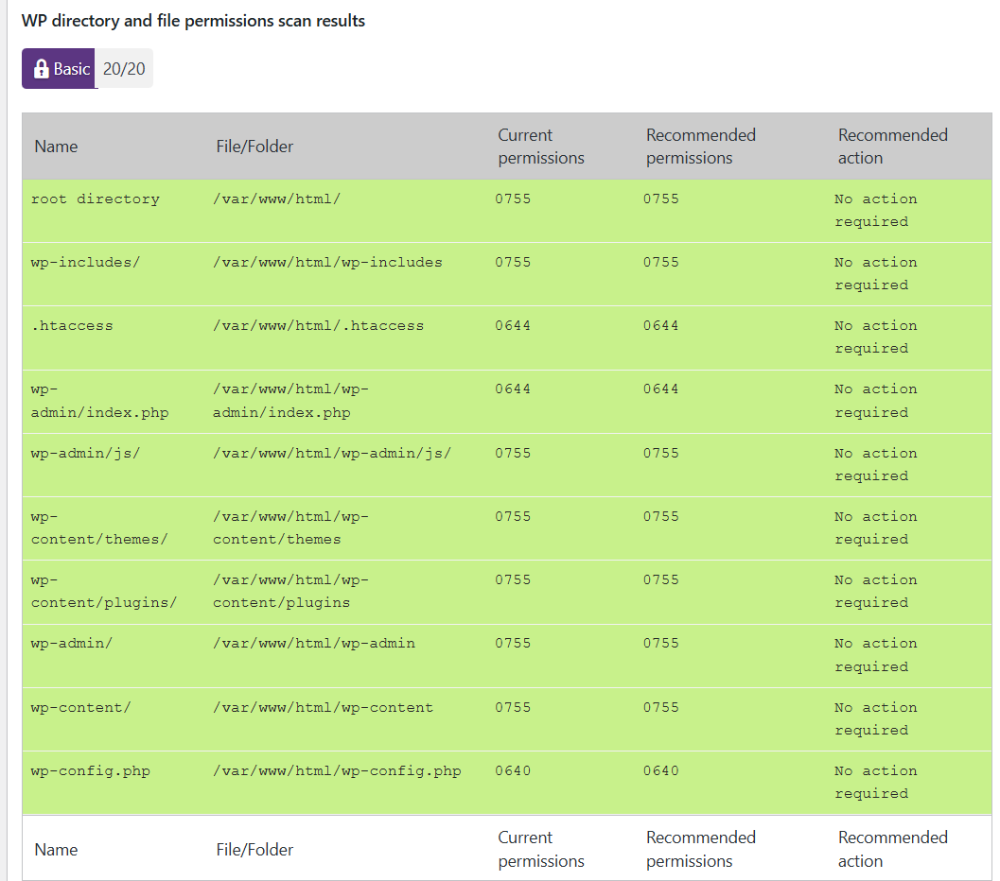
    - Выполнена проверка прав доступа к файлам
    - Применены рекомендуемые настройки

### Firewall:
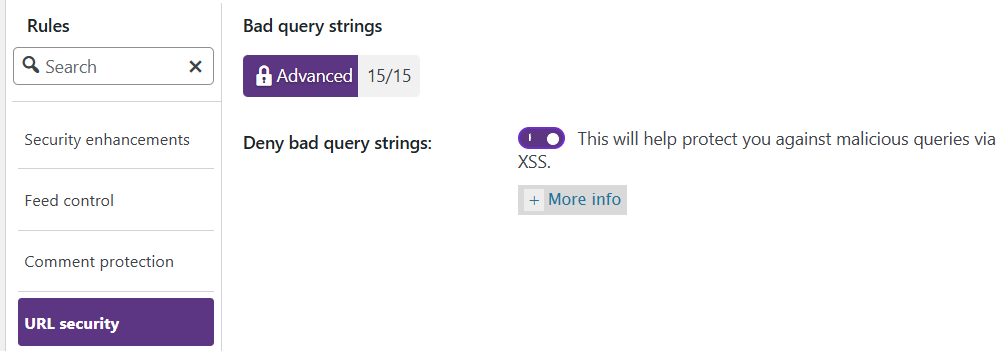
    - Активирован базовый уровень защиты
    - Включена защита от вредоносных запросов (Bad Query Strings, XSS)

### Brute Force:
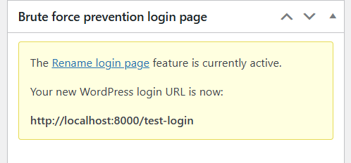
Изменён URL страницы входа на нестандартный

### Scanner / Malware:
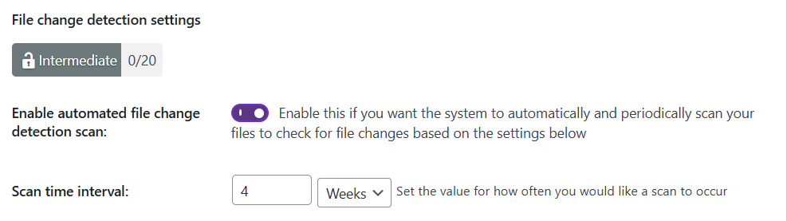
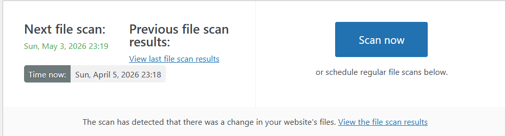

### Backup:
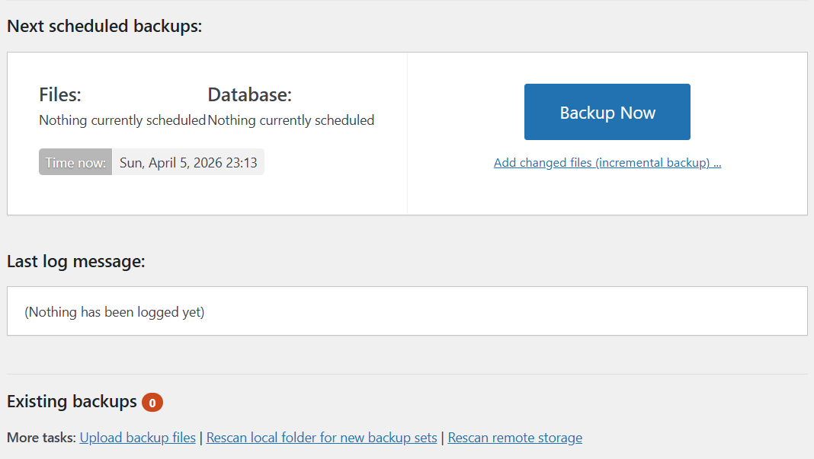
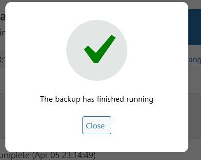
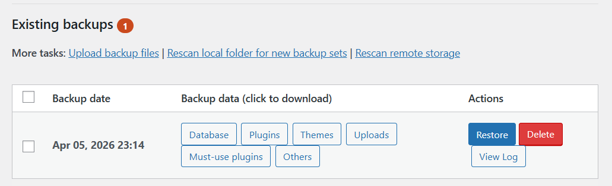

### Notifications:
Включены email-уведомления о событиях безопасности

## Шаг 6. Проверка защиты от брутфорса (на тестовом пользователе)
Выполнена проверка защиты:
    - выполнен выход из системы
    - произведено 5–6 попыток входа с неверным паролем
    - система автоматически заблокировала доступ
Факт блокировки подтверждён в журнале (Logs) плагина.
  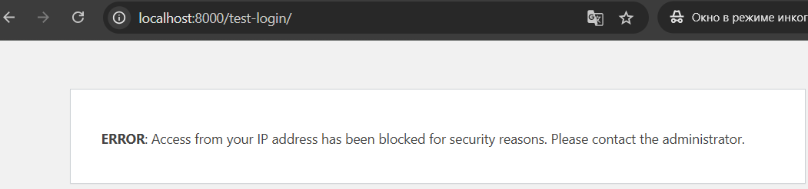
  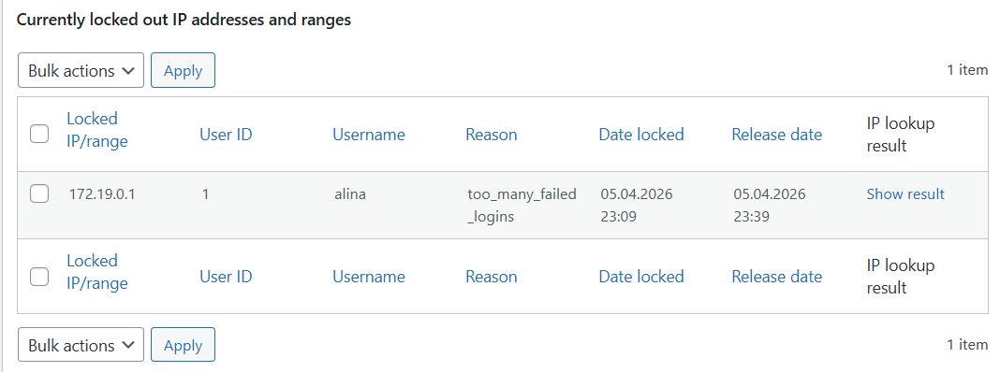

## Шаг 7. Восстановление из резервной копии
  
  
  
После восстановления данные успешно восстановлены.


## Вывод
В ходе лабораторной работы были изучены и применены основные методы защиты WordPress.
Были настроены безопасные параметры доступа, обновления, защита файлов и система мониторинга.
Также была реализована защита от брутфорс-атак и настроено резервное копирование.
Использование плагина AIOS позволило значительно повысить уровень безопасности сайта.

## Контрольные вопросы
1. **Почему DISALLOW_FILE_EDIT и правильные права на wp-config.php существенно уменьшают риск пост-эксплойта?**
Если злоумышленник уже получил доступ к админке, он может попытаться изменить файлы сайта через встроенный редактор WordPress.
DISALLOW_FILE_EDIT отключает этот редактор. То есть даже если взломали админку, менять код через панель уже нельзя.
Права на wp-config.php ограничивают доступ к самому важному файлу (там данные базы). Чем меньше прав - тем сложнее его прочитать или изменить.
В итоге злоумышленнику сложнее закрепиться на сайте и нанести вред.


2. **Какие параметры Login Lockdown/Firewall вы выбрали и почему именно такие (обоснуйте баланс безопасности и UX)?**
Были выбраны такие настройки:
  * Max Login Attempts: 5 -защита от перебора, но не мешает обычным пользователям
  * Retry Time: 15 минут - даёт паузу после ошибок
  * Lockout Time: 30 минут - достаточно, чтобы остановить атаку
  * Force Logout: 24 часа - не даёт держать сессию бесконечно


3. **Чем отличаются меры защиты на уровне WordPress (плагин/WAF) от мер на уровне веб-сервера и ОС?**
  * WordPress (плагины/WAF) - защита на уровне сайта (логины, формы, XSS)
  * Веб-сервер (Apache/Nginx) - фильтрация запросов, доступ к файлам
  * ОС - права пользователей, процессы, общая безопасность сервера


4. **Что обязательно включать в "полный" бэкап WP и как вы проверяете, что восстановление действительно работает?**
В бэкап входит: База данных (все записи, пользователи), папка wp-content (темы, плагины, загрузки), wp-config.php

Проверка: Удалить данные (запись/файл), восстановить бэкап и
проверить, что всё вернулось и сайт работает без ошибокк

## Использованные источники
1. Репозиторий, автор Никита Нартя URL: https://github.com/MSU-Courses/content-management-systems
2. [developer.wordpress], URL: https://developer.wordpress.org/advanced-administration/security/hardening/
